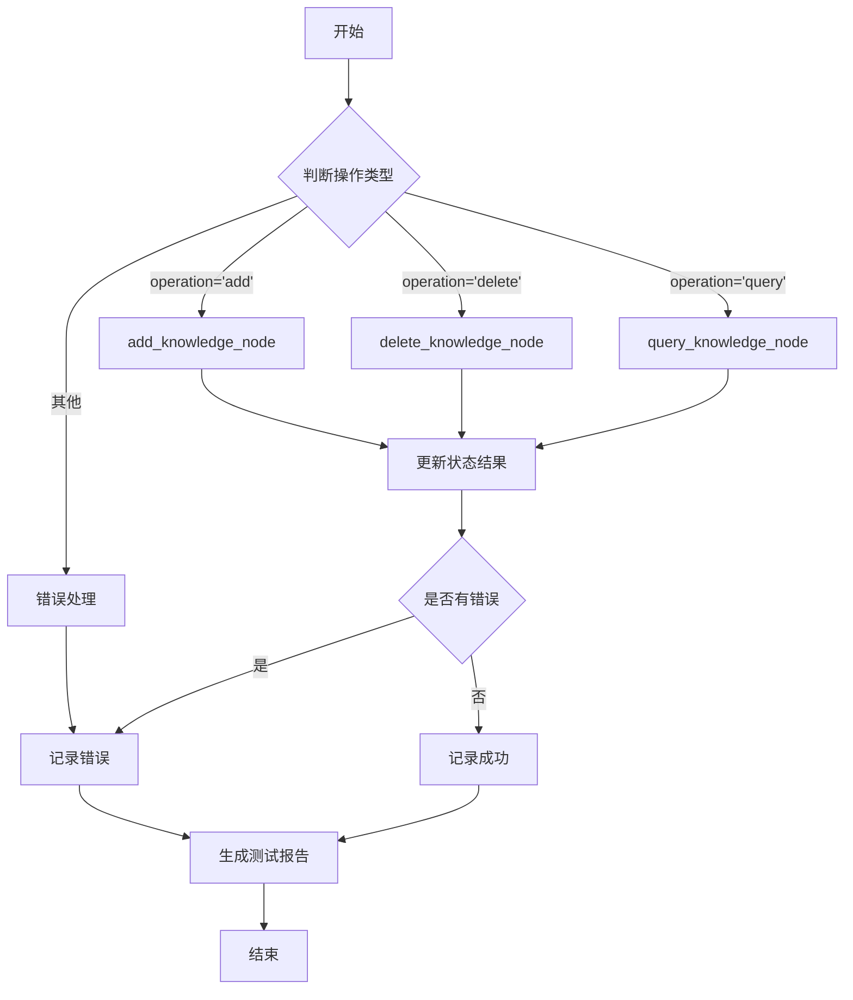

# RAG测试程序状态结构定义文档

## 概述

本文档定义了基于LangGraph框架的RAG测试程序的状态结构，包含知识库内容添加、删除、查询三个功能节点的状态流转。

## 状态结构定义

### 主状态 (RAGTestState)

```python
class RAGTestState(TypedDict):
    """
    RAG测试程序主状态
    
    字段说明：
    - operation: 当前操作类型 ("add"/"delete"/"query")
    - collection_name: 目标集合名称
    - db_name: 数据库名称
    - documents: 文档列表（用于添加/删除操作）
    - query_text: 查询文本（用于查询操作）
    - query_params: 查询参数配置
    - results: 操作结果
    - error: 错误信息
    - execution_time: 执行耗时
    - node_history: 节点执行历史
    - test_report: 测试报告
    """
```

### 字段详细说明

#### 1. 操作控制字段

| 字段名 | 类型 | 说明 | 示例值 |
|--------|------|------|--------|
| `operation` | str | 当前操作类型 | "add", "delete", "query" |
| `collection_name` | str | 目标集合名称 | "chat_history" |
| `db_name` | str | 数据库名称 | "LLM_vtuber" |

#### 2. 数据字段

| 字段名 | 类型 | 说明 | 示例值 |
|--------|------|------|--------|
| `documents` | List[Dict] | 文档列表 | [{"content": "...", "metadata": {...}}] |
| `query_text` | str | 查询文本 | "Milvus是什么？" |
| `query_params` | Dict | 查询参数 | {"top_k": 3, "metric_type": "COSINE"} |

#### 3. 结果字段

| 字段名 | 类型 | 说明 | 示例值 |
|--------|------|------|--------|
| `results` | Dict | 操作结果 | {"success": True, "data": [...]} |
| `error` | Optional[str] | 错误信息 | "连接失败" |
| `execution_time` | float | 执行耗时（秒） | 1.234 |

#### 4. 测试报告字段

| 字段名 | 类型 | 说明 | 示例值 |
|--------|------|------|--------|
| `node_history` | List[Dict] | 节点执行历史 | [{"node": "add", "status": "success"}] |
| `test_report` | Dict | 测试报告 | {"total_tests": 3, "passed": 3} |

## 节点定义

### 1. 知识库内容添加节点 (add_knowledge_node)

**功能**：向知识库添加新文档

**输入状态**：
- `operation`: "add"
- `documents`: 待添加的文档列表
- `collection_name`: 目标集合名称

**输出状态**：
- `results`: 添加结果（包含插入的ID列表）
- `error`: 错误信息（如有）
- `execution_time`: 执行耗时

**状态流转**：
```
输入状态 -> add_knowledge_node -> 输出状态
```

### 2. 知识库内容删除节点 (delete_knowledge_node)

**功能**：从知识库删除指定文档

**输入状态**：
- `operation`: "delete"
- `documents`: 待删除的文档列表（包含ID或过滤条件）
- `collection_name`: 目标集合名称

**输出状态**：
- `results`: 删除结果（包含删除数量）
- `error`: 错误信息（如有）
- `execution_time`: 执行耗时

**状态流转**：
```
输入状态 -> delete_knowledge_node -> 输出状态
```

### 3. 知识库内容查询节点 (query_knowledge_node)

**功能**：从知识库查询相关文档

**输入状态**：
- `operation`: "query"
- `query_text`: 查询文本
- `query_params`: 查询参数（top_k, metric_type等）
- `collection_name`: 目标集合名称

**输出状态**：
- `results`: 查询结果（包含相似文档列表）
- `error`: 错误信息（如有）
- `execution_time`: 执行耗时

**状态流转**：
```
输入状态 -> query_knowledge_node -> 输出状态
```

## 条件路由

### 操作类型路由

根据 `operation` 字段的值，状态图将路由到不同的节点：

```
开始
  |
  v
判断 operation
  |-- "add" --> add_knowledge_node
  |-- "delete" --> delete_knowledge_node
  |-- "query" --> query_knowledge_node
  |-- 其他 --> 错误处理
```

## 状态流转图



## 错误处理

### 错误类型

1. **连接错误**：无法连接到Milvus服务
2. **参数错误**：缺少必要的参数或参数格式不正确
3. **操作错误**：添加/删除/查询操作失败
4. **路由错误**：未知的操作类型

### 错误处理流程

1. 捕获异常
2. 记录错误信息到 `error` 字段
3. 更新 `node_history` 记录失败状态
4. 继续执行后续节点（如测试报告生成）

## 测试报告格式

```python
{
    "test_summary": {
        "total_tests": 3,
        "passed": 3,
        "failed": 0,
        "total_execution_time": 5.678
    },
    "node_results": [
        {
            "node_name": "add_knowledge_node",
            "status": "success",
            "execution_time": 1.234,
            "details": {"inserted_count": 5}
        },
        {
            "node_name": "delete_knowledge_node",
            "status": "success",
            "execution_time": 0.567,
            "details": {"deleted_count": 2}
        },
        {
            "node_name": "query_knowledge_node",
            "status": "success",
            "execution_time": 0.876,
            "details": {"retrieved_count": 3}
        }
    ],
    "errors": []
}
```

## 使用示例

### 添加操作

```python
state = {
    "operation": "add",
    "collection_name": "chat_history",
    "db_name": "LLM_vtuber",
    "documents": [
        {"content": "Milvus是一个向量数据库", "metadata": {"source": "doc1"}}
    ]
}
```

### 删除操作

```python
state = {
    "operation": "delete",
    "collection_name": "chat_history",
    "db_name": "LLM_vtuber",
    "documents": [
        {"message_id": "xxx-xxx-xxx"}
    ]
}
```

### 查询操作

```python
state = {
    "operation": "query",
    "collection_name": "chat_history",
    "db_name": "LLM_vtuber",
    "query_text": "Milvus是什么？",
    "query_params": {"top_k": 3, "metric_type": "COSINE"}
}
```
